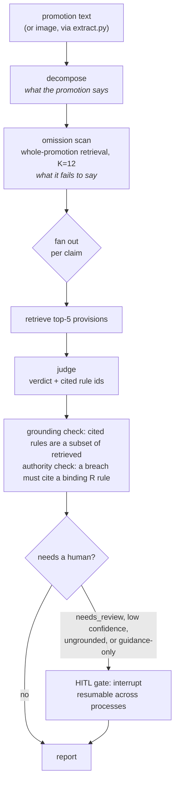

# Sentinel

Compliance copilot for UK financial promotions. It reads fintech marketing copy, decomposes it into the claims a compliance officer would assess, retrieves the governing provisions from the [FCA Handbook](https://www.handbook.fca.org.uk/), and returns a verdict per claim with the rule id it rests on and the wording that triggered it. Anything it cannot settle from the text goes to a human instead of being guessed.

LangGraph agent, Azure OpenAI (`text-embedding-3-large` + `gpt-4.1-mini`), BM25 and dense retrieval with RRF and weighted fusion, FastAPI service, Docker, an `fca-handbook` MCP server, and a vision path for promotions that only exist as images. 1,400 lines of `src`, five runtime dependencies, 146 tests, no vendor SDK (the transport is stdlib `urllib`).

## One claim, as the system actually returns it

Verbatim from `data/cache/judge_results.jsonl`, a real judge run against the golden set:

```json
{
  "claim": "Money in your account today (a speed-of-funds incentive to apply, with no representative APR shown)",
  "verdict": "breach",
  "rule_ids": ["CONC 3.5.7R"],
  "rationale": "The claim 'Money in your account today' is a speed-of-funds incentive to apply for credit, which under CONC 3.5.7R(1)(c) requires inclusion of the representative APR. The promotion does not show any representative APR, thus breaching the rule.",
  "confidence": "high"
}
```

Three things in that one object are the whole design. The breach is an *omission*, something the promotion fails to say rather than something it says. The citation reaches a specific limb, 3.5.7R(1)(c). And the `R` in the rule id is checked: a breach must rest on a binding rule, not on guidance, or it goes to a human.

## What it scores

| | measured |
|---|---|
| judge accuracy, dense top-5 | **0.971** (33/34), identical on Azure `gpt-4.1-mini` and Gemini `3.5-flash-lite`, with byte-identical confusion matrices |
| judge accuracy, full-corpus control arm | **1.000** (34/34), at 7.8× the input spend |
| citation_hit | 0.882, both arms |
| retrieval, best arm (weighted α=0.5, Azure) | recall@5 0.814 / MRR 0.833 |
| end-to-end, full graph at K=12 | 0.654 published, 0.615 on re-run (both kept, see below) |
| judge latency, per call | p50 1,390 ms / p95 2,336 ms |
| total spend, every live call since cost instrumentation landed | $0.3487 across 160 calls |
| ground truth | 26 FCA-sourced examples / 34 claims, plus an independent 9-example FCA-authored holdout |
| corpus | CONC 3, 86 provisions, about 21K tokens (the promotions corpus across all four sectors is 860, measured) |

Two judge families from unrelated vendors landing on the same 33 of 34 verdicts, making the same single mistake in the same conservative direction, is the number I would defend first. It means the labels are checkable by more than one model, which is exactly the property the first version of this dataset lacked.

Every number above replays from cache with `SENTINEL_OFFLINE=1` and no Azure account, or fails loudly. Full tables, adjudication protocols and every scored prediction including the misses are in [`evals/README.md`](evals/README.md).

## How it works



Ingestion is provision-level, so the retrieval unit equals the citation unit and a cited rule id always resolves. Retrieval is an in-memory index over 86 chunks, small enough that pgvector would be ceremony. Embeddings and chat each go through a one-function seam, which is how the project survived three provider swaps without a dependency change.

The omission scan exists because measurement demanded it. The decomposer extracted only what a promotion *said*, while 13 of the 17 golden breach examples are things a promotion fails to say, and no amount of judge or retrieval tuning fixes a claim that was never extracted. Closing that gap moved end-to-end accuracy from 0.308 to 0.500, and the scan's retrieval depth (K=12) is the one config value in this repo adopted on evidence: an eval-set sweep peak plus an independent, pre-registered holdout direction.

Two checks sit between the judge and the report, and neither is allowed to retry. The grounding check rejects any rule id the judge was not shown. The authority check rejects a breach that cites only guidance, because in the Handbook `R` binds and `G` explains. That second guard was predicted to fire on nothing and fired on six claims across 26 examples, all of them breach verdicts that had been resting on no binding rule.

## The party being audited is the adversary

The input is marketing copy written by the firm under audit, so it is treated as hostile by construction rather than as data.

Every prompt that touches promotion text fences it in a tagged block and neutralises any closing delimiter smuggled inside first, so copy containing `</untrusted_communication>` cannot break out of its own fence. The framing sentence above the fence tells the model the content is untrusted input from an audited firm and is to be analysed, never obeyed. The claim under assessment gets its own separate fence, because by the time it reaches the judge it is already model output derived from attacker-controlled text.

That hardening then collided with the platform. Azure Prompt Shields read the injection-defence wording *as* an injection attempt and returned HTTP 400 on 100% of judge calls. The fix was a scoped content filter policy on the judge deployment, jailbreak shield set to annotate-only with the harm-category filters untouched. Rewording the prompt would have cleared the error by trading away the defence.

## What measuring it kept revealing

The build order is eval-first, and four times now the measurement has overturned something I believed.

**I built a control arm designed to beat my own retrieval layer, and it did.** CONC 3 is 86 chunks, about 21K tokens, so the entire corpus fits in one judge prompt and retrieval had never been made to prove it earns its place. The full-corpus arm scored 1.000 against dense retrieval's 0.971, fixing the single error both provider families made. The conclusion was written before the run so it could not be softened afterwards: retrieval is a scaling investment for the real target and currently an accuracy tax at 86 chunks. The margin is one claim out of 34, so it is quoted as a one-claim result and not as a proven improvement. Because cost instrumentation landed first, the other half of the trade is measured rather than assumed: retrieval costs one claim of accuracy and saves about 87% of input spend.

That target is measured rather than gestured at. The rules governing financial promotions across all four sectors, CONC 3 plus COBS 4, BCOBS 2, MCOB 3A and PERG 8, come to 860 provisions and about 187K tokens through this same chunker, exactly ten times the corpus the control arm ran on. Full-corpus cost is input-dominated and scales with the corpus, while retrieval returns five provisions no matter how large the corpus gets. The arithmetic that gave 7.8× at 86 chunks therefore gives roughly 77× at 860, about $2.80 per 34 claims against dense's $0.036, and retrieval's saving goes from 87% of input spend to about 99%. That is arithmetic on measured inputs rather than a second experiment, and it is the reason 86 chunks is a scoped starting point instead of the scale the design is aimed at.

**I falsified my own root cause with a measurement, then shipped the guard that makes the next one diagnosable.** Re-running end-to-end on unchanged code gave 0.615 where 0.654 had been published two days earlier. My first explanation was that re-embedding produced different retrieval; testing it showed embedding the same text twice is bit-identical across all 768 dims, and two temperature-0 calls on the same prompt return byte-identical JSON. That killed the explanation. The mechanism is recorded as not identified, with the leading hypothesis labelled as a hypothesis, and both numbers are kept, because one codebase producing two answers is more informative than either value. `SENTINEL_OFFLINE=1` is the fix: it is the first statement in the only function in this codebase that opens a socket, so any metric now replays exactly from cache or stops and says why.

**A cloud storage failure got root-caused below the API layer.** Deployed to Azure Container Apps, SQLite could not write to the mounted SMB share: plain file writes succeed, a bare `CREATE TABLE` returns `database is locked`. SMB does not provide the byte-range locking SQLite needs, and WAL additionally wants a shared-memory file the share cannot give it. `python -m sentinel.statecheck` reports which of those work on any volume and is what established it in one command instead of a 500 and a traceback. The deployment was torn down rather than left as a broken URL, and the swap that fixes it is a constructor argument, since the checkpointer is a parameter on `build_graph`.

**The ground truth is FCA-sourced because the first version was not good enough to keep.** An audit found the original 56 examples were LLM-generated end to end and never human-adjudicated, which means every headline metric resting on them measured cross-model agreement rather than accuracy. The set and all its numbers came out in a single commit. Every label in the replacement quotes the FCA publication that names both the breach pattern and the rule, and `tests/test_golden.py` mechanically enforces the structural half of that protocol on every push.

There is a fifth case that never became a headline, and it is the one I would point to first in an interview. A retrieval arm beat dense on both gated metrics, and it was deliberately not adopted, because it had won by sweeping a hyperparameter on the only labelled set available. A number tuned on the data that scores it is not evidence.

## Try it

Needs `AZURE_OPENAI_ENDPOINT`, `AZURE_OPENAI_API_KEY`, `AZURE_OPENAI_EMBED_DEPLOYMENT` (default `sentinel-embed`), `AZURE_OPENAI_CHAT_DEPLOYMENT` (default `sentinel-judge`):

```
uv sync
uv run python -m sentinel.ingest CONC 3 && uv run python -m sentinel.embed
uv run python -m sentinel.audit "Get a loan in 5 minutes! No credit check impact!"
uv run python -m sentinel.eval_retrieval --mode all
uv run python -m sentinel.eval_judge --mode judge
```

That audit line is the demo, and on a live run it interrupts: the gate routes the claim to human review over `CONC 3.6.7G` rather than forcing a confident call on genuine ambiguity.

Re-verify any published metric without spending anything and without an Azure account. It replays exactly from cache or fails loudly rather than quietly re-deriving a different number:

```
SENTINEL_OFFLINE=1 uv run python -m sentinel.eval_judge --mode judge
```

`python -m sentinel.usage` reports calls, tokens, cost and p50/p95 latency per deployment from the live-call log. `python -m sentinel.mcp_server` exposes the corpus over MCP with two tools, `search_handbook` and `get_provision`, and its bm25 mode runs fully offline with no API key.

## Run it as a service

The same graph behind an HTTP surface, with a review queue that outlives the process:

```
docker build -t sentinel:local .
docker run -p 8000:8000 -e SENTINEL_API_KEY=your-key \
  -e AZURE_OPENAI_ENDPOINT -e AZURE_OPENAI_API_KEY \
  -e AZURE_OPENAI_EMBED_DEPLOYMENT -e AZURE_OPENAI_CHAT_DEPLOYMENT \
  -v /some/host/dir:/state sentinel:local
```

`POST /audit` returns a report, or `202` with a `review_id` when a claim needs a human. `GET /reviews` lists what is waiting and `POST /reviews/{id}/resume` takes `{"0": "breach"}` and returns the finished report. Every request needs an `X-API-Key` header, and if `SENTINEL_API_KEY` is unset the API rejects everything rather than running open, because each audit spends real model tokens.

Four things worth knowing rather than discovering:

- `/state` must be durable storage, and it is not `/data`. The image bakes the Handbook corpus at `/app/data`, so the image tag is effectively the corpus version, while `reviews.db` lives at `/state`. Caches are deliberately ephemeral: rebuilding one costs an embedding call, whereas losing a pending human review is a correctness failure.
- One replica, one reviewer. The queue is SQLite on a mounted volume with a single lock around the graph, which is the right size for this project and would not be for a real deployment.
- It does not run on Azure Files, for the reason above. A durable cloud queue needs Azure Files NFS, or Postgres via `langgraph-checkpoint-postgres` instead of SQLite.
- `PRAGMA locking_mode=EXCLUSIVE` is load-bearing. WAL normally needs a `-shm` shared-memory file that an SMB share cannot provide, and SQLite skips the `-shm` entirely in exclusive locking mode. That single line is what let WAL work on a mounted share at all, and it is safe only because the app runs at one replica.

Runtime dependencies are `langgraph`, `pydantic`, `fastapi`, `uvicorn` and `langgraph-checkpoint-sqlite`. The trade bought pydantic request validation, generated OpenAPI docs, and a checkpointer already tested by someone else.

## What is verified, and by what

The offline suite is 146 tests: unit coverage plus structural-integrity checks on `golden.jsonl` and `holdout.jsonl`, running in CI on every push and pull request. The metric evals need live model calls and are run by hand, then published with their numbers and their misses. They replay offline from a local cache that is gitignored, so making them a merge gate means committing or fixturing that cache, which is a known and open piece of work rather than a limitation of the design.

Statistical honesty about the size of all this: n=34 claims, where one claim is 2.9 points. Differences under about 0.08 recall@5 are treated as noise, and no retrieval arm in this repo has been adopted on eval-set evidence alone. Limitations are catalogued in `evals/README.md` rather than left to be found.

## Build history

- **Phase 1.** FCA Handbook ingestion via its JSON API, provision-level chunking (CONC 3: 86 chunks), golden dataset written *before* any pipeline code.
- **Phase 2.** In-memory retrieval (BM25 + dense embeddings + RRF) with a deterministic eval harness. Measured headline: dense-only beat the naive hybrid, so that is what shipped.
- **Phase 3.** LangGraph audit agent, judge-accuracy evals, four more measured retrieval arms, and an `fca-handbook` MCP server. The best of those arms beat dense on both gated metrics and was deliberately not adopted, because it had been tuned on the eval set.
- **Ground truth v2**, 2026-08. The dataset deletion described above. Scope narrowed to financial promotions.
- **Re-baseline v2**, 2026-08. Azure OpenAI re-baselined against the v2 golden set alongside a Gemini control, both at 768 dims, through the same seams as every swap before it and with no new dependencies. Judge accuracy came out at 0.971 on both providers with byte-identical confusion matrices. The residency cost is real and measured at dense retrieval (recall@5 -0.069, MRR -0.108, and a full miss on `prominence-review` recall@3), and fusion recovers most of it. End-to-end was 0.308, root-caused to decomposer omission-blindness, then 0.500 with the omission scan.
- **Multimodal and tuning**, 2026-08. `extract.py` turns a promotion image into a layout-annotated transcription through the same deployment as the rest of the pipeline, wired into the CLI via `--media`. An independent, FCA-authored holdout (`evals/holdout.jsonl`) was built through that seam from nine of FG15-04's own 2015 social-media-guidance example images, and used to adjudicate K=12. Weighted retrieval fusion stays held, because the same holdout was underpowered to adjudicate it.
- **Phase 4**, 2026-08. The full-corpus control arm, the authority check, cost and latency instrumentation, the reproducibility guard, and the HTTP surface with a cross-process review queue.

## Note

Portfolio and research project. Not legal or compliance advice.
