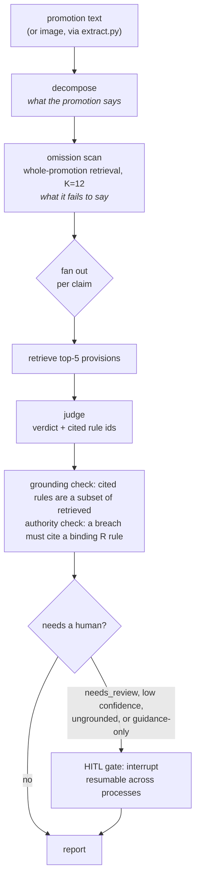

# Sentinel

Compliance copilot for UK financial promotions. Audits fintech marketing copy against the [FCA Handbook](https://www.handbook.fca.org.uk/) and flags potential breaches with cited evidence.

The premise: an agentic RAG system in a regulated domain is only deployable if you can prove it works. So the build order is eval-first, and the interesting output of this project is not the pipeline — it is what measuring the pipeline kept revealing about it.

## What measuring it found

**Retrieval loses to putting the whole corpus in the prompt.** CONC 3 is 86 chunks, about 21K tokens, so a control arm could stuff all of it into the judge prompt instead of retrieving. It scored 1.000 against dense retrieval's 0.971, fixing the single error both provider families made. The conclusion was written *before* the run so it could not be softened afterwards: retrieval is a scaling investment for the Handbook-scale target, and currently an accuracy tax at 86 chunks. The margin is one claim out of 34 — 2.9 points — and is quoted as a one-claim result, not a proven improvement. Cost instrumentation landed first, so the other side of the trade is measured too: the full-corpus arm costs about 7.8 times the input spend for that one claim.

**A published metric turned out not to reproduce.** Re-running end-to-end on unchanged code gave 0.615 where 0.654 had been published two days earlier. Both numbers are kept. The cause was traced node by node through cache timestamps, and the first explanation — that re-embedding produced different retrieval — was then falsified by measurement: embedding the same text twice is bit-identical, and two temperature-0 calls on the same prompt return byte-identical JSON. The mechanism is recorded as **not identified**, with the leading hypothesis labelled as a hypothesis. `SENTINEL_OFFLINE=1` now makes any metric replay exactly from cache or fail loudly instead of silently re-deriving.

**The durable review queue does not work on Azure Files.** Deployed to Azure Container Apps, SQLite could not write to the mounted SMB share at all — plain file writes succeed, a bare `CREATE TABLE` returns `database is locked`, because SMB does not provide the byte-range locking SQLite needs. `python -m sentinel.statecheck` reports which of those work on any volume and is what established it. The deployment was torn down rather than left as a broken URL.

**The original golden dataset was deleted, not caveated.** An audit found its 56 examples were LLM-generated end to end and never human-adjudicated, so every headline metric resting on them measured cross-model agreement rather than accuracy. The set and all its numbers were removed in a single commit and replaced with an FCA-sourced one whose every label quotes the FCA publication that names the pattern and the rule.

Full tables, the adjudication protocols and every scored prediction — misses included — are in [`evals/README.md`](evals/README.md). Limitations are catalogued separately rather than left to be found.

## How it works



The omission scan exists because measurement demanded it: the decomposer extracted only what a promotion *said*, while most golden breaches are things it fails to say. That gap was worth 0.308 → 0.500 end-to-end when closed, and the retrieval depth behind it (K=12) is the one config value adopted on evidence — an eval-set sweep peak plus an independent, pre-registered holdout direction.

Ingestion is provision-level: the retrieval unit equals the citation unit, so a cited rule id always resolves. Retrieval is an in-memory index (BM25 + dense + RRF + weighted fusion, four measured arms) — small enough that pgvector would be ceremony, and the control arm above is now the reason to be sceptical of scaling it at all. Embeddings and chat each go through a one-function seam, which is how the project survived three provider swaps without a dependency change.

## Try it

Needs `AZURE_OPENAI_ENDPOINT`, `AZURE_OPENAI_API_KEY`, `AZURE_OPENAI_EMBED_DEPLOYMENT` (default `sentinel-embed`), `AZURE_OPENAI_CHAT_DEPLOYMENT` (default `sentinel-judge`):

```
uv sync
uv run python -m sentinel.ingest CONC 3 && uv run python -m sentinel.embed
uv run python -m sentinel.audit "Get a loan in 5 minutes! No credit check impact!"
uv run python -m sentinel.eval_retrieval --mode all
uv run python -m sentinel.eval_judge --mode judge
```

Any published metric can be re-verified without spending anything, and will fail loudly rather than quietly re-derive if its cache is cold:

```
SENTINEL_OFFLINE=1 uv run python -m sentinel.eval_judge --mode judge
```

## Run it as a service

The same graph behind an HTTP surface, with a review queue that outlives the process:

```
docker build -t sentinel:local .
docker run -p 8000:8000 -e SENTINEL_API_KEY=your-key \
  -e AZURE_OPENAI_ENDPOINT -e AZURE_OPENAI_API_KEY \
  -e AZURE_OPENAI_EMBED_DEPLOYMENT -e AZURE_OPENAI_CHAT_DEPLOYMENT \
  -v /some/host/dir:/state sentinel:local
```

`POST /audit` returns a report, or `202` with a `review_id` when a claim needs a human. `GET /reviews` lists what is waiting and `POST /reviews/{id}/resume` takes `{"0": "breach"}` and returns the finished report. Every request needs an `X-API-Key` header; if `SENTINEL_API_KEY` is unset the API rejects everything rather than running open, because each audit spends real model tokens.

Four things worth knowing rather than discovering:

- **`/state` must be durable storage, and it is not `/data`.** The image bakes the Handbook corpus at `/app/data`, so the image tag is effectively the corpus version; `reviews.db` lives at `/state` instead. Caches are deliberately ephemeral, because rebuilding one costs an embedding call, while losing a pending human review is a correctness failure.
- **One replica, one reviewer.** The queue is SQLite on a mounted volume, with a single lock around the graph. That is the right size for this project and would not be for a real deployment.
- **It does not run on Azure Files**, for the reason described above. A durable cloud queue needs Azure Files **NFS**, or Postgres via `langgraph-checkpoint-postgres` instead of SQLite. The checkpointer is a parameter on `build_graph`, so that swap is a constructor change rather than a rewrite.
- **Dependencies grew here.** Runtime is now `langgraph`, `pydantic`, `fastapi`, `uvicorn` and `langgraph-checkpoint-sqlite`, which ends the "two runtime dependencies" streak this README had been publishing. The trade bought pydantic request validation, generated OpenAPI docs, and a checkpointer that is already tested by someone else.

## What is verified, and by what

The offline suite — unit tests plus the structural-integrity checks on `golden.jsonl` and `holdout.jsonl` — runs in CI on every push and pull request. The metric evals (retrieval, judge accuracy, end-to-end) need live model calls, so they are run by hand and published with their numbers and their misses. CI does not gate them, and cannot: the caches they replay from are local-only.

## Build history

- **Phase 1** — FCA Handbook ingestion via its JSON API, provision-level chunking (CONC 3: 86 chunks), golden dataset written *before* any pipeline code.
- **Phase 2** — in-memory retrieval (BM25 + dense embeddings + RRF) with a deterministic eval harness. Measured headline: dense-only beat the naive hybrid, so that is what shipped.
- **Phase 3** — LangGraph audit agent, judge-accuracy evals, four more measured retrieval arms, and an `fca-handbook` MCP server. The best of those arms beat dense on both gated metrics and was deliberately *not* adopted, because it had been tuned on the eval set.
- **Ground truth v2** (2026-08) — the dataset deletion described above. Scope narrowed to financial promotions.
- **Re-baseline v2** (2026-08) — Azure OpenAI (`text-embedding-3-large` dense, `gpt-4.1-mini` judge) re-baselined against the v2 golden set alongside a Gemini control, both at 768 dims, through the same seams as every swap before it and with no new dependencies. Judge accuracy came out at .971 on both providers with byte-identical confusion matrices: the same one miss, in the same conservative direction, from two unrelated model families. The residency cost is real and measured at dense retrieval (recall@5 -0.069, MRR -0.108, and a full miss on `prominence-review` recall@3), and fusion recovers most of it. End-to-end was .308, root-caused to decomposer omission-blindness, then 0.308 → 0.500 with the omission scan.
- **Multimodal and tuning** (2026-08) — `extract.py` turns a promotion image into a layout-annotated transcription through the same deployment as the rest of the pipeline, wired into the CLI via `--media`. An independent, FCA-authored holdout (`evals/holdout.jsonl`) was built through that seam from nine of FG15-04's own 2015 social-media-guidance example images, and used to adjudicate K=12. Weighted retrieval fusion stays held, because the same holdout was underpowered to adjudicate it.
- **Phase 4** (2026-08) — the full-corpus control arm, an authority check that a breach cites a binding rule rather than guidance, cost and latency instrumentation, the reproducibility guard, and the HTTP surface with a cross-process review queue.

## Note

Portfolio/research project. Not legal or compliance advice.
